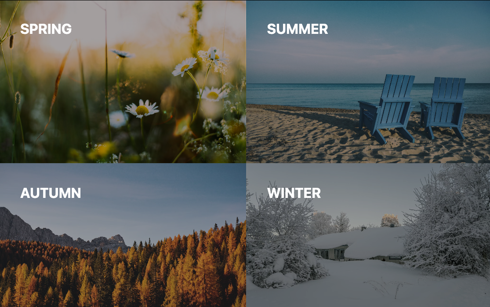

# Image Gallery

In this challenge, you will encounter the following tasks, creating a grid template

Use grid to change the layout:

- **Spring** is displayed in the upper left corner
- **Summer** is displayed in the upper right corner
- **Autumn** is displayed at the bottom left
- **Winter** is displayed at the bottom right

Hint

 You need only two lines of code in your grid container

## Notes

- You only have to touch the `./css/styles.css` file.

## Expected Result

## Development

### Local Development

Run `npm run start` to start a development server and open [localhost:3000](http://localhost:3000) in a browser.

> Alternatively you can use the Live Preview Extension for Visual Studio Code to view this project.  
> Select the HTML file you want to view, press <kbd>⇧</kbd><kbd>⌘</kbd><kbd>P</kbd>, search for `Live Preview: Show Preview` and confirm with <kbd>Enter</kbd>.

### Scripts

You can use the following commands:

- `npm run start` to start a development server
