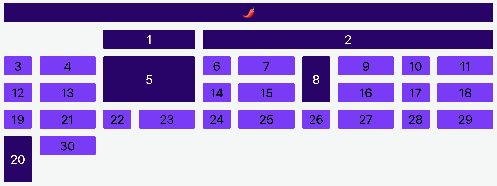

# Place Elements

In this challenge, you will encounter the following tasks:

- placing elements in specific cells
- stretching elements over multiple cells

## Tasks

- [ ] `.element__1` should start at column three and go until column five  
- [ ] `.element__2` should start at column five and go until the end  
- [ ] `.element__5` should span two columns and two rows  
- [ ] `.element__8 should` span two rows
- [ ] `.element__spiced should` be in row one and span the entire grid width  
- [ ] `.element__20 should` start at row six and span two rows

## Notes

- You only have to touch the `./css/styles.css` file.

## Expected Result

## Development

### Local Development

Run `npm run start` to start a development server and open [localhost:3000](http://localhost:3000) in a browser.

> Alternatively you can use the Live Preview Extension for Visual Studio Code to view this project.  
> Select the HTML file you want to view, press <kbd>⇧</kbd><kbd>⌘</kbd><kbd>P</kbd>, search for `Live Preview: Show Preview` and confirm with <kbd>Enter</kbd>.

### Scripts

You can use the following commands:

- `npm run start` to start a development server
