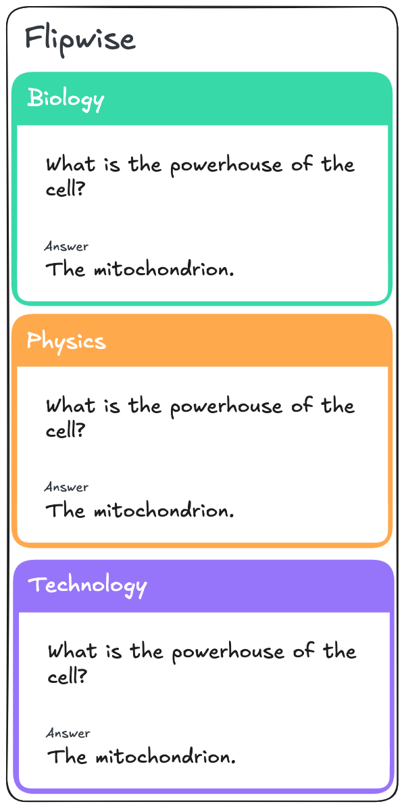

# Flashcard List

## Value Proposition

**As a user**

**I want to** browse a list of flashcards,

**so that** I can easily access and review the questions I need to study.

## Description

## Acceptance Criteria

- The homepage displays a list of flashcards.
- The title of the app is displayed clearly at the top of the page.
- Each flashcard listing includes:
  - Flashcard question
  - Flashcard answer
  - Flashcard collection it belongs to
- The Flashcard is highlighted in the collection color.
- The list supports vertical scrolling to accommodate multiple entries.

## Tasks

- [ ] Create feature branch `feature/flashcard-list`
- [ ] Inspect and adapt the example data in the [db-assets folder](./../db-assets/flashcards.json)
- [ ] Capstone Group Todo: Add tasks
